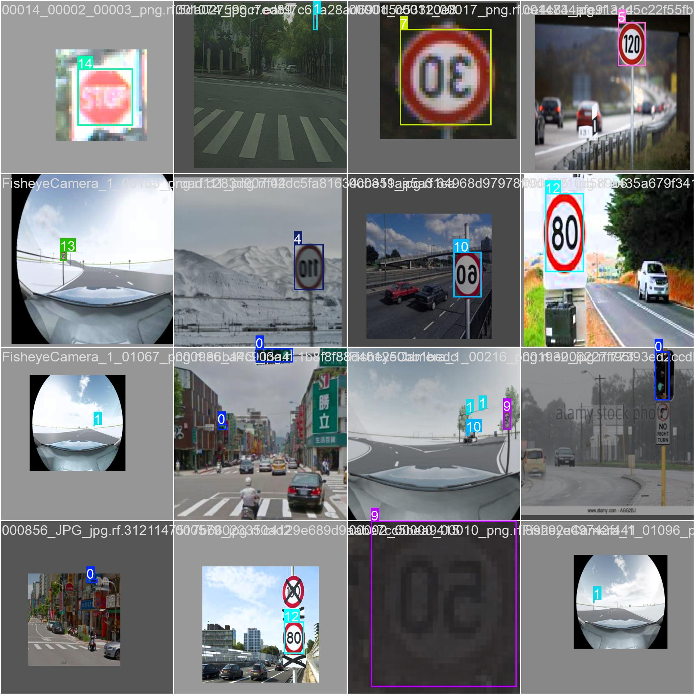
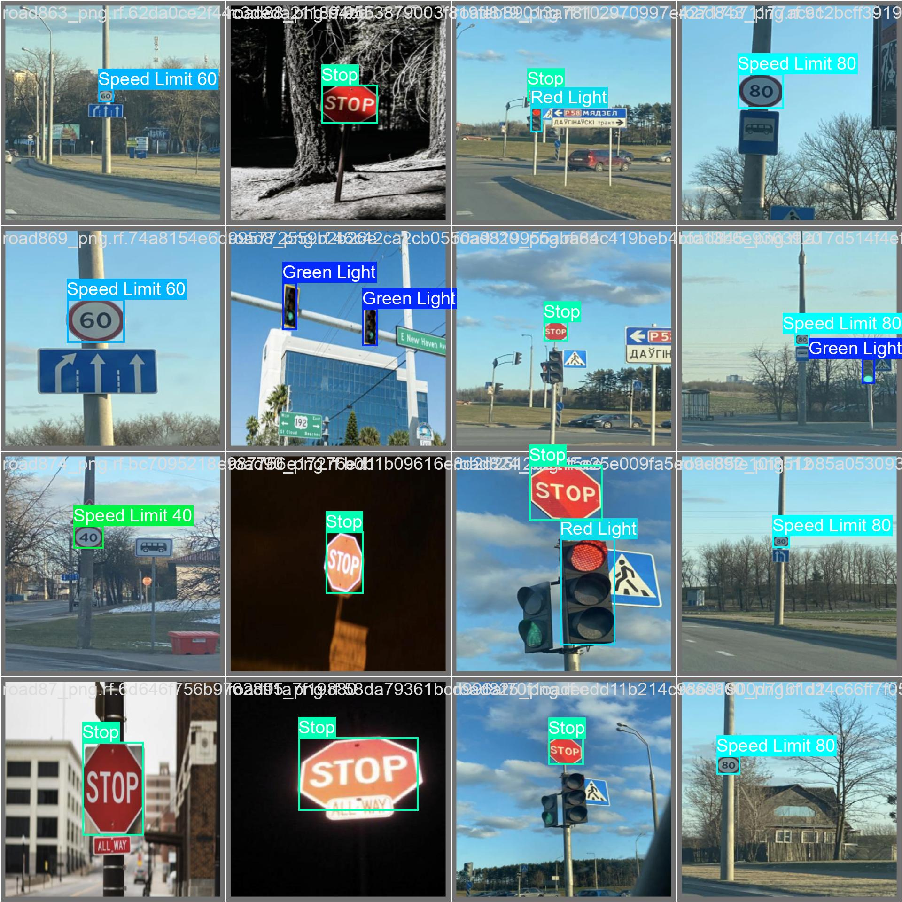

# 🚦 Traffic Sign Recognition using YOLOv8

A deep learning project for **real-time traffic sign detection** using **YOLOv8** and **transfer learning**.  
This project detects and classifies **15 different traffic signs** from images and videos, making it useful for **autonomous driving** and **traffic monitoring systems**.

---

## 📌 Features

- ✅ Trained YOLOv8 on a custom dataset (15 traffic sign classes)
- ✅ Supports **image, batch image (zip), and video (mp4)** inference
- ✅ High performance: Precision 0.95 | Recall 0.93 | mAP@50 = 0.97 | mAP@50-95 = 0.85
- ✅ Save results with bounding boxes, labels, and confidence scores
- ✅ Export model to **ONNX / TorchScript / TFLite** for deployment
- ✅ Ready for **real-time deployment** with API/Streamlit

---

## 📂 Dataset

**Source:** Kaggle (Roboflow Traffic Sign Dataset)

**Classes (15 total):**
```python
['Green Light', 'Red Light', 'Speed Limit 10', 'Speed Limit 20',
 'Speed Limit 30', 'Speed Limit 40', 'Speed Limit 50', 'Speed Limit 60',
 'Speed Limit 70', 'Speed Limit 80', 'Speed Limit 90', 'Speed Limit 100',
 'Speed Limit 110', 'Speed Limit 120', 'Stop']
```

**Dataset Split:**
- Train: 3,530 images
- Valid: 801 images
- Test: 638 images

---

## 🏋️ Model Training

```python
from ultralytics import YOLO

# Load pre-trained YOLOv8
model = YOLO("yolov8n.pt")

# Train on custom dataset
model.train(
    data="data.yaml",
    epochs=50,
    imgsz=640,
    batch=16
)
```

### 🖼️ Training Samples

| Training Batch | Validation Labels | Validation Predictions |
|----------------|-------------------|------------------------|
|  |  |  |

---

## 🎯 Evaluation Results

**Overall Performance:**
- Precision: **0.954**
- Recall: **0.938**
- mAP@50: **0.970**
- mAP@50-95: **0.848**

**Per-Class Results (examples):**
- Green Light → P: 0.84, R: 0.76, mAP50: 0.88
- Red Light → P: 0.84, R: 0.75, mAP50: 0.82
- Stop → P: 1.00, R: 0.98, mAP50: 0.99
- Speed Limit signs (20–120) → Avg. P/R above 0.95

---

## 📊 Inference

### 🔹 On Images

```python
model = YOLO("best.pt")
results = model.predict(source="path/to/image.jpg", conf=0.25, save=True)
```

### 🔹 On Batch Images (ZIP Upload)

```python
results = model.predict(source="uploaded_images/", conf=0.25, save=True)
```

### 🔹 On Video (MP4)

```python
results = model.predict(source="input_video.mp4", conf=0.25, save=True)
```

**Example Output Video:**  
🎥 [Watch Prediction Demo](Prediction.avi)

---

## 📦 Deployment

**Export model:**
```python
model.export(format="onnx")   # or "torchscript", "tflite"
```

**Deployment Options:**
- Deploy with **FastAPI / Flask / Streamlit**
- Use in **real-time video streams**
- Integration with edge devices

---

## ⚙️ Environment

- **Ultralytics:** 8.3.203
- **Python:** 3.12.11
- **Torch:** 2.8.0+cu126
- **GPU:** Tesla T4 (15GB CUDA)

---

## 📌 Results

- ✅ Accurate detection of traffic signs in images and videos
- ✅ Strong metrics (mAP@50 = 0.97) across all classes
- ✅ Ready for **autonomous driving** and **traffic monitoring** use cases

---

## 🚀 Getting Started

1. **Clone the repository:**
   ```bash
   git clone https://github.com/yourusername/traffic-sign-recognition.git
   cd traffic-sign-recognition
   ```

2. **Install dependencies:**
   ```bash
   pip install ultralytics opencv-python
   ```

3. **Run inference:**
   ```bash
   python predict.py --source your_image.jpg --weights best.pt
   ```

---

## 📜 License

This project is released under the **MIT License**.

---

## 👤 Author

**Your Name**
- LinkedIn: [https://www.linkedin.com/in/junaid-khan-13507a272](https://linkedin.com/in/yourprofile)
- GitHub: [junaidniazi1](https://github.com/yourusername)

---

## 🤝 Contributing

Contributions, issues, and feature requests are welcome! Feel free to check the [issues page](https://github.com/yourusername/traffic-sign-recognition/issues).

---

## ⭐ Show Your Support

Give a ⭐ if this project helped you!
